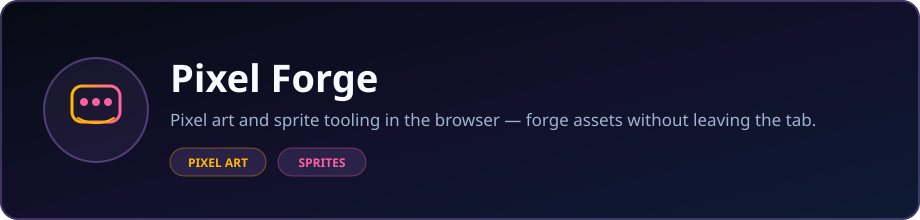

<p align="center">
  
</p>

<p align="center">
  <strong>Pixel art and sprite tooling in the browser — forge assets without leaving the tab.</strong>
</p>

<p align="center">
  <a href="https://dacameragirl.github.io/pixelforge/"></a>
  <a href="https://github.com/DaCameraGirl/pixelforge"></a>
</p>

<p align="center">
  
  
</p>

### Languages

<p align="center">
  
  
  
</p>

### Stack

<p align="center">
  
  
</p>

<p align="center">
  Built by <strong>Angela Hudson</strong> · <a href="https://github.com/DaCameraGirl">DaCameraGirl</a>
</p>
# 🎮✨ PixelForge

**PixelForge** is a colorful multi-engine game lab with **five playable browser arcade games** plus **four companion engine demos** built with **Pygame, Love2D, Defold, and MonoGame**.

🌐 **Play it live:** https://dacameragirl.github.io/pixelforge/


<p align="center"></p>
<p align="center"></p>


### 🌈 Browser Arcade Cabinet

The live GitHub Pages site runs in the browser with **JavaScript Canvas**, keyboard input, mouse/touch support, scoring, waves, lives, and restart controls.

**Included arcade games:**

- 🟡 **Neon Chomp** — maze chase score attack with pellets, power lanes, and hunters
- ☄️ **Asteroid Forge** — vector asteroid shooter with thrust, bullets, waves, and splitting rocks
- 🛢️ **Barrel Tower** — ladder climbing, jumps, rolling hazards, and a top exit goal
- 🐛 **Bug Spiral** — segmented swarm shooter before the swarm reaches the cannon lane
- ⛏️ **Tunnel Miner** — dig tunnels, collect gems, stun enemies, and clear the underground round

### 🚀 Companion Engine Games

These demos show the same arcade/game-loop ideas across different engines and languages.

| Engine | Language | Game Demo | File |
| --- | --- | --- | --- |
| 🐍 **Pygame** | **Python** | **Asteroid Field** | `demos/pygame/asteroid_field.py` |
| 🌙 **Love2D** | **Lua** | **Neon Breakout** | `demos/love2d/main.lua` |
| 🧩 **Defold** | **Lua** | **Shooter Script** | `demos/defold/game.script` |
| 💠 **MonoGame** | **C# / .NET** | **Space Shooter** | `demos/monogame/Game1.cs` |

<p align="center"></p>
<p align="center"></p>


| Language | Where | What It Does |
| --- | --- | --- |
| 🌐 **HTML** | `index.html` | Page structure, arcade sections, engine demo cards |
| 🎨 **CSS** | `styles.css` | Neon arcade styling, layout, responsive panels, visual polish |
| 🟨 **JavaScript** | `app.js` | Browser game loops, Canvas rendering, input, collision, scoring |
| 🐍 **Python** | `launcher.py`, `demos/pygame/` | Desktop launcher and Pygame asteroid shooter |
| 🌙 **Lua** | `demos/love2d/`, `demos/defold/` | Love2D breakout game and Defold shooter script |
| 💠 **C#** | `demos/monogame/` | MonoGame space shooter loop and procedural drawing |
| 📝 **Markdown** | `README.md` | Project documentation |

<p align="center"></p>
<p align="center"></p>


### Browser Arcade

- ⌨️ **Arrow keys / WASD:** move or steer
- 🔫 **Space:** start, shoot, or trigger the active game action
- 🖱️ **Mouse / touch:** supported in the browser cabinet
- 🔁 **R:** restart
- ▶️ **Start Game:** launch the selected arcade mode

### Engine Demos

Each engine demo uses the normal controls for that game file. The Pygame and MonoGame demos are playable locally, while the Defold script is meant to be attached inside the Defold editor.

<p align="center"></p>
<p align="center"></p>


### 🌐 Browser Arcade

Open `index.html` directly, or serve the folder:

```bash
python -m http.server 8000
```

Then open:

```text
http://localhost:8000
```

### 🐍 Pygame

```bash
pip install pygame-ce
python demos/pygame/asteroid_field.py
```

### 🌙 Love2D

```bash
love demos/love2d/
```

### 💠 MonoGame

```bash
dotnet new --install MonoGame.Templates.CSharp
dotnet new mgdesktopgl -n PixelForgeDemo
```

Then replace the generated `Game1.cs` with `demos/monogame/Game1.cs` and run:

```bash
dotnet run
```

### 🧭 Desktop Launcher

```bash
python launcher.py
```

<p align="center"></p>
<p align="center"></p>


```text
.
├── index.html                 # GitHub Pages arcade shell
├── styles.css                 # Neon PixelForge styling
├── app.js                     # Browser arcade game logic
├── launcher.py                # Python desktop launcher
├── demos/
│   ├── pygame/                # Python Pygame asteroid shooter
│   ├── love2d/                # Lua Love2D breakout game
│   ├── defold/                # Lua Defold shooter script
│   └── monogame/              # C# MonoGame space shooter
├── README.md
└── LICENSE
```

<p align="center"></p>
<p align="center"></p>


🎮 [The Engine Lab](https://github.com/DaCameraGirl/game-engine-lab) — Part I: Godot, Panda3D, Solar2D, and Stride.

---

**Built by Angela Hudson — 2026** ✨